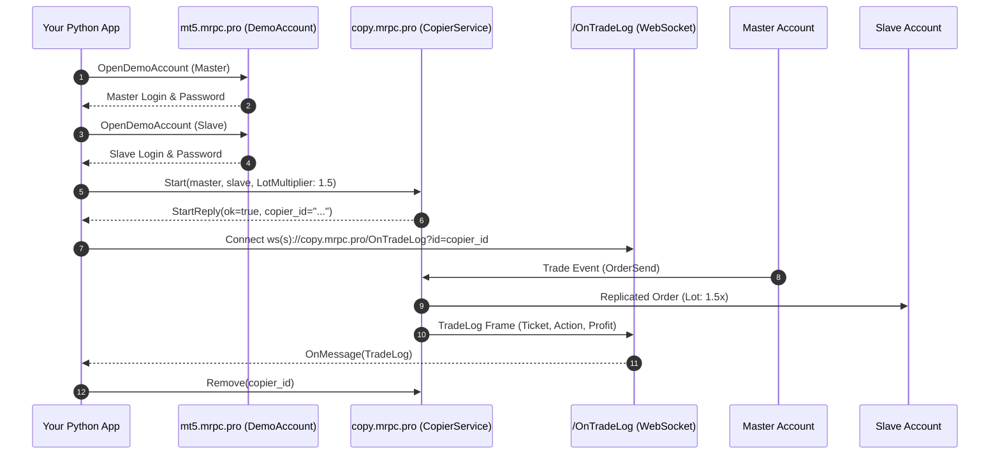

# Quick Start: Your First Project in 10 Minutes

This step-by-step tutorial walks you through building a complete trade replication application in **Python** from scratch using **PyCopier**.

---

## 1. Overview of Steps

In this guide you will:
1. **Provision two demo MetaTrader accounts** via gRPC (`DemoAccount.OpenDemoAccount`).
2. **Connect to MetaRPC Trade Copier** over HTTP/2 gRPC (`copy.mrpc.pro:443`).
3. **Start an active copier** configured with risk multipliers and SL/TP synchronization.
4. **List all registered copiers** and inspect their state.
5. **Stream real-time trade logs** via WebSocket (`/OnTradeLog?id={copierId}`).
6. **Pause and remove** the copier cleanly.

---

## 2. Complete Runnable Code

```python
import asyncio
from pycopier import CopierService, DemoAccountClient, Account, StartRequest

async def main():
    # 1. Provision Demo Accounts via gRPC
    demo = DemoAccountClient("https://mt5.mrpc.pro:443")
    master = await demo.open_demo_account(company="MetaQuotes-Demo", first_name="Master", last_name="Trader", email="master@example.com", server="MetaQuotes-Demo")
    slave = await demo.open_demo_account(company="MetaQuotes-Demo", first_name="Slave", last_name="Follower", email="slave@example.com", server="MetaQuotes-Demo")
    print(f"Master login: {master.login}, Slave login: {slave.login}")

    # 2. Connect to Trade Copier gRPC Service
    copier = CopierService("copy.mrpc.pro:443", user_key="YOUR_USER_KEY")

    # 3. Start Copier
    req = StartRequest(
        user_key="YOUR_USER_KEY",
            master=Account(type="MT5", user=master.login, password=master.password, server=master.server),
        slave=Account(type="MT5", user=slave.login, password=slave.password, server=slave.server),
        risk_type="LotMultiplier",
        risk_value="1.5",
        copy_sl=True,
        copy_tp=True,
        copy_pending_orders=True,
        reverse_copy=False
    )
    res = await copier.start(req)
    print(f"Copier started successfully: {res.copier_id}")

    # 4. List copiers
    active = await copier.list()
    for c in active.copiers:
        print(f"Copier {c.id}: {c.master_user} -> {c.slave_user}, Status: {c.risk_type} {c.risk_value}")

    # 5. Stream trade logs
    async for log in copier.stream_trade_logs(res.copier_id):
        print(f"[TRADE] Slave Ticket: {log.slave_order.ticket}, Profit: {log.profit}")
        break

    # 6. Pause and Remove
    await copier.pause(res.copier_id, paused=True)
    await copier.remove(res.copier_id)
    print("Copier removed.")

if __name__ == "__main__":
    asyncio.run(main())
```

---

## 3. How It Works Under the Hood


